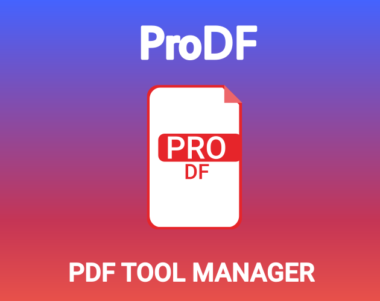

# 📄 ProDF - PDF Tool Manager

**Version:** 1.0.0

**Author:** Joa98




Python-based tool built with pyqpdf, CustomTkinter, wkhtmltopdf and pdf2image, where you can manage and convert PDFs.

## 🚀 Features

* Merge various PDFs into one file
* Split a PDF into various documents
* Compress files to share it easly
* Rotate it!
* Convert an HTML or a website into a PDF file
* Make a PDF into an HTML file
* Never stores or share users data

## 🗃️ Requirements

* **Python 3.10+**
* **pyqpdf**, **pdf2image** and **customtkinter** - (installed via `requirements.txt`)
* wkhtmltopdf modules -> [Download HERE!](https://wkhtmltopdf.org/downloads.html)
* qpdf modules -> [Download HERE!](https://github.com/qpdf/qpdf/releases)
* Linux / Windows / macOS

## ⚙️ Installation

### 🐧 Linux (Debian/Ubuntu)

```
# Install Python and Git
sudo apt update && sudo apt install python3 python3-pip git

# Clone the repository
git clone https://github.com/Joa98Dev/prodf.git
cd prodf

# Set up a virtual envrionments
python3 -m venv venv
source venv/bin/activate

# Install dependencies
pip install -r requirements.txt

# Create a folder and named as bin
# Download the wkhtmltopdf and qpdf modules
# Add the wkhtmltopdf and qpdf modules to the bin folder

# Run the app
python main.py
```

### 🐧 Linux (Arch)

```
# Install Python and Git
sudo pacman -S python python-pip git

# Clone the repository
git clone https://github.com/Joa98Dev/prodf.git
cd prodf

# Set up a virtual environment
python -m venv venv
source venv/bin/activate

# Install dependencies
pip install -r requirements.txt

# Create a folder and named as bin
# Download the wkhtmltopdf and qpdf modules
# Add the wkhtmltopdf and qpdf modules to the bin folder

# Run the app
python main.py
```

### 🪟 Windows 10/11

```
# Install Python from https://python.org (check "Add to PATH" during installation)
# Open CMD/PowerShell as Administrator

# Clone the repo
git clone https://github.com/Joa98Dev/prodf.git
cd prodf

# Set up a virtual environment
python -m venv venv
venv\Scripts\activate

# Install dependencies
pip install -r requirements.txt

# Create a folder and named as bin
# Download the wkhtmltopdf and qpdf modules
# Add the wkhtmltopdf and qpdf modules to the bin folder

# Run the app
python main.py
```

### 🍎 macOS

```
# Install Homebrew (if not installed)
/bin/bash -c "$(curl -fsSL https://raw.githubusercontent.com/Homebrew/install/HEAD/install.sh)"

# Install Python and Git
brew install python git

# Clone the repo
git clone https://github.com/Joa98Dev/prodf.git
cd Pytube_Downloader

# Set up a virtual environment
python3 -m venv venv
source venv/bin/activate

# Install dependencies
pip install -r requirements.txt

# Create a folder and named as bin
# Download the wkhtmltopdf and qpdf modules
# Add the wkhtmltopdf and qpdf modules to the bin folder

# Run the app
python3 main.py
```

## 📦 Compiled Version

Don't want to compile it yourself?
Then you can download a precompiled version for **Linux** and **Windows** [here]()
